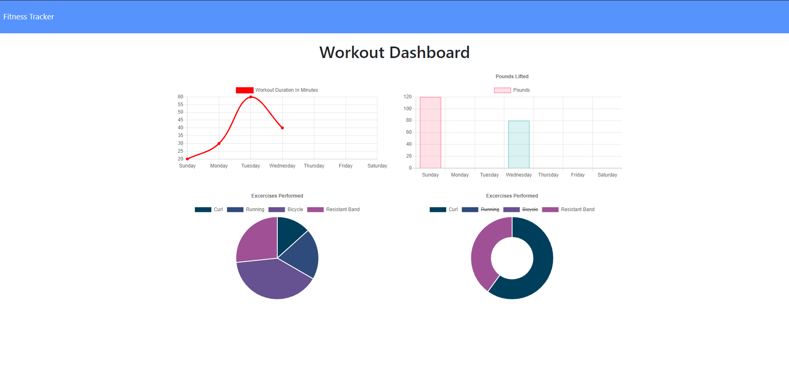

# WorkoutTracker

# Description

This is a personalized app that tracks your workout sessions and save those sessions on the database. This app displays the session data on dashboard so that the user can easily track and identify what exercises he or she did and how long he or she did on a day.

# Table of Contents 

* [Installation](#installation)

* [Usage](#usage)

* [License](#license)

* [Contributing](#contributing)

* [Tests](#tests)

* [Questions](#questions)

# Installation

The following necessary dependencies must be installed to run the application properly: express, mongoose, morgan

# Usage

​This application is used for This app is used for tracking exercises.

# License

This project is license under the MIT license.

# Contributing

​Contributors: Chang Yeon Hong

# Tests

To run tests, you need to run the following command: There is not test but you are more than welcome to fork this repo.

# Questions

If you have any questions about the repo, open an issue or contact chong0810 directly hongchangyeon@gmail.com.

https://workouttracker-chong0810.herokuapp.com/